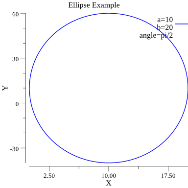
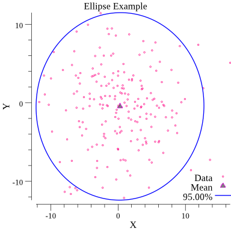

# gollipse: plott confidence ellipse of 2D normally distributed data

[](https://github.com/milosgajdos/gollipse/actions?query=workflow%3ACI)
[](https://pkg.go.dev/github.com/milosgajdos/gollipse)
[](https://opensource.org/licenses/Apache-2.0)
[](https://goreportcard.com/report/github.com/milosgajdos/gollipse)

`gollipse` provides a simple `Go` package which allows to easily create [ellipse](https://en.wikipedia.org/wiki/Ellipse) curve. The package provides a simple API to generate a predefined number of points on the ellipse curve which can then be plotted and saved as an image in a file.

Besides the abilitiy to create simple ellipses, the package API also provides a way to create confidence ellipses from normally distributed 2D data i.e. [Gaussian](https://en.wikipedia.org/wiki/Gaussian_function) data, with a predefined level of confidence. This is handy for covariance error analysis when dealing with 2D normally distributed data.

The package takes advange of the amazing [gonum](https://www.gonum.org) suite of libraries for scientific computing in `Go` [1]

# Get started

Get the source code:

```
$ go get -u github.com/milosgajdos/gollipse
```

Get dependencies:

```
$ make dep
```

Run the tests:

```
$ make test
```

# Examples

You can create a simple ellipse rotated by 90 degrees around the origin as follows:

```Go
package main

import (
	"image/color"
	"log"
	"math"

	"github.com/milosgajdos/gollipse/ellipse"
	"gonum.org/v1/plot"
	"gonum.org/v1/plot/vg"
)

func main() {
	ell, err := ellipse.New(50, 10, math.Pi/2)
	if err != nil {
		log.Fatalf("Failed to create ellipse: %v", err)
	}

	// Create new plot
	p, err := plot.New()
	if err != nil {
		log.Fatalf("Failed to create mew plot: %v", err)
	}
	p.Title.Text = "Ellipse Example"
	p.X.Label.Text = "X"
	p.Y.Label.Text = "Y"

	// generate ellipse curve: we request 100 points
	line, _, err := ell.LinePoints(100)
	if err != nil {
		log.Fatalf("Failed to compute ellipse curve points: %v", err)
	}

	// ellipse line plot
	line.Color = color.RGBA{B: 255, A: 255}
	p.Add(line)
	p.Legend.Add("a=10,b=20,angle=pi/2", line)

	// Save the plot to a PNG file.
	if err := p.Save(4*vg.Inch, 4*vg.Inch, "example.png"); err != nil {
		log.Fatalf("Failed to plot ellipse: %v", err)
	}
}
```

And the resulting ellipse curve looks like this:



Note that the above ellipse's `a` length ("X-axis" length) is set to 50 and `b` length ("Y-axis" length) is set to 10, but since the resulting ellipse is rotated by 90 degrees (`math.Pi/2`) around the origin its length along **Y axis** is 50 and 10 along **X axis**.

You can find more elaborate example in the [examples](examples/) directory which generates a bunch of random numbers and then creates and plots an ellipse whose region contains 95% of all samples that can be drawn from the underlying data Gaussian distribution. See the ellipse plot below:



# References

[1] [Gonum: A set of packages designed to make writing numerical and scientific algorithms](https://www.gonum.org/)
